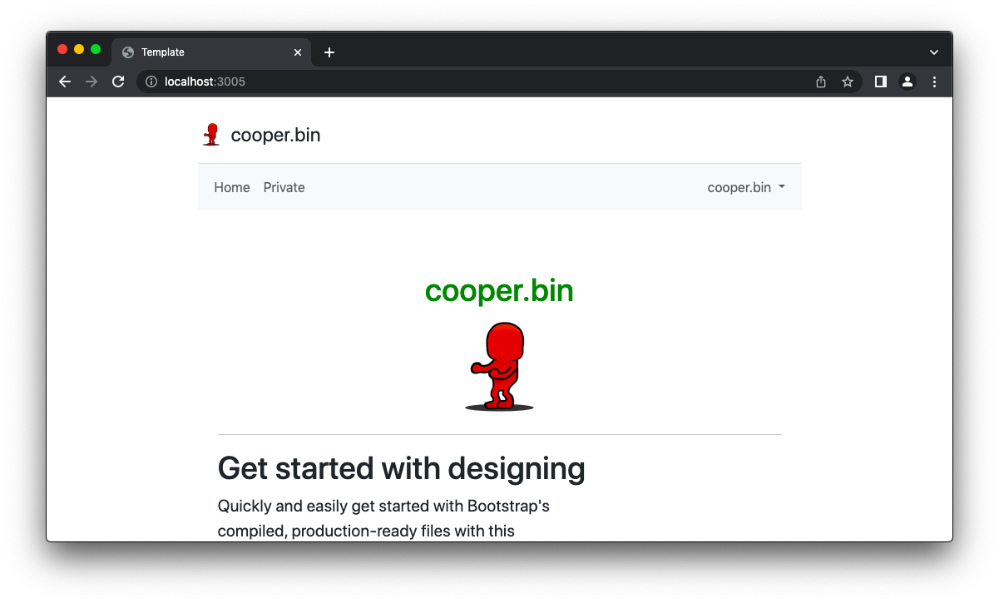

# Node.JS - cooper's basic webserver template

This template provides a simple Node.JS webserver with an user auth system. The auth is realized by a JWT. JWT stands for "JSON Web Token", which is a standard format for representing and transmitting data as a JSON object. In the context of authentication, a JWT is a token that is issued by a server to a client after the client has successfully authenticated with the server. There is no frontend register option but there is an CLI register command to create new users.

## What can this template do?

This template provides a webserver with easy to hook up server routes, a template engine and default middleware to indicate the user. Theres also a pre configured `public` folder with sample `CSS`, `JS` and `image` files which show how to use it in a template.
More information about the routes and templates can be found in the `Routes` and `Templates` chapter below.

---

### What is this template used for?

I created this template for my local homeserver projects. I often write small utilities that I want to be able to access from anywhere in the world. Well, sometimes it's enough to reach them when I'm just not at home. With this template I can create a simple and fast Webpage with an auth requirement so that not every asshole can access the webapps I'am running on my homeserver.


## Getting started

```
git clone {REPO.URL}
```

```
npm install
```

Now you can go to the server settings to adjust the parameters to your needs. Server settings are stored in `./settings.js`.

```javascript
module.exports = {
    server: {
        port: 3000
    },
    auth: {
        secret: 'mySuperSecretServerwideTokenHere',
        // How long should the login session be valid?
        // 2 minutes, 5 hours, 12 days, .... || or  type a simple "1000" for 1000ms validity
        valid:  '10 minutes'
        
    }
}
```

`port` : 	 Port on which the web server will be running
`secret`:   The secret is for the creation of the JWT token and can be chosen at will.
`valid`: 	This parameter determines how long a login session is valid. You can enter values as described in the file.

Once this is done, the first user can be created. To do this, execute the following command in the terminal:
```terminal
cooper@homeserver$ node utils/create_user.js
```

```terminal
cooper@homeserver$ node utils/create_user.js 
prompt: Username:  me-cooper
prompt: Password:  
Please add new user > me-cooper < manually to './database/userlist.js'
{
  id: 1,
  username: 'me-cooper',
  password: '$2a$10$iJ8NNBFveS2KnyJCzLxmc.aWxeYW.v5l6Do5nbowM0xBCZrWYbIT.'
}
cooper@homeserver$
```

Copy the user object and paste it into `./database/userlist.js`.

```javascript
module.exports = [
  {
    id: 1,
    username: 'me-cooper',
    password: '$2a$10$iJ8NNBFveS2KnyJCzLxmc.aWxeYW.v5l6Do5nbowM0xBCZrWYbIT.'
  }
]
```

### Run the server

```terminal
cooper@homeserver$ node server.js 
Server is running on port:  3000
```



There is already a proteted route accessable under `localhost:3000/private` so if you're logged in it will be visitable. Otherwise you will be redirected to `localhost:3000/login` to login with your account. You can use this route as sample as well but there are two extra sample files which demnstrate both a public and a proctected route.

## Add new Routes to your server

To add a new route to your webserver you simply have to copy either `sample_public_route.js` or `sample_private_route.js`.
New route will be registered with the name of the file automatically. If you rename it to `list.js` it will available under `localhost:3000/list`. If you name it `doorlock.js` it will be accessable under `localhost:3000/doorlock` - very easy.

Following code is from the `sample_public_route.js`:

```javascript
route.get('/', [ middleware.user.get ], (req, res, next) => {

    var templateData = {
      user: req.user
    };

    // OWN LOGIC
    templateData.test = "Sample string";

    console.log(templateData);
    
    eta.renderFile(path.join(viewsPath, 'sample_view'), templateData)
    .then(html => {
      res.status(200).send(html);
    })
    .catch(err => {
      console.error(err);
      res.sendStatus(500);
    });
    
})
```

`sample_view` is the template to be rendered with the route. It is stored under `./views/sample_view.eta`.

You can add custom data to the `templateData` object. This object is accessable wihtin the template. If a user is logged in, it will be automatically added to `templateData` via `req.middlewareData`. So if you log `templateData` to the console it will be look like this.

**Not logged in:**

```terminal
{ 
	user: undefined, 
	test: 'Sample string' 
}
```

**Logged in:**

```terminal
{ 
	user: { 
		username: 'me-cooper' 
	}, 
	test: 'Sample string' 
}
```


### Middleware

There are two types of middleware functions:

1. middleware.auth.isValid - turn the route into a protected route
2. middleware.user.get - safes user (if available) in `req.user`

`middleware.user.get` can always be used. If you want to turn a public route into an protected route, just add the middleware:

```javascript
app.get('/customRoute', [middleware.user.get, middleware.auth.isValid], function (req, res) {
  res.send('Auth is valid. User is logged in! Otherwise it already has been redirected to login before get to this point');
});
```

If you want to add own middleware, you can take a look at `./src/middleware`.

## Templates

ETA is uses as the template engine. You can access the `templateData` obejct in the template as follows:

```text
<h1 class="colorChange">
	<% if(it.user){ %>
		<%= it.user.username %>
	<% }else{ %>
		lass mich in ruhe
	<% } %>
</h1>

<p><%= it.test %></p>
```

You can import other templates like showed in the `sample_view`file:

```text
<%~ includeFile('partials/header', { it }) %>

Sample View

<%~ includeFile('partials/footer', { it }) %>
```

For more information about the rendering engine visit [https://eta.js.org/](https://eta.js.org/)

To access files located in the `./public` folder, just use as follows:

```html
<link rel="stylesheet" href="css/main.css" />

<script type="text/javascript" src="js/main.js"></script>
```

You can add new folders / files in `./public` as you want and access them the same way.

---


This template is a very easy way to:

1. Fast deployment of a node.js webserver with basic auth without the need of a database
2. All needed frontend files are ready to embed and use: `js` `css` and general `assets` folder
3. Easy to hook up new routes with one single `copy`, `paste` & `rename` procedure 
4. fast and easy template engine for dynamic displays on frontend

